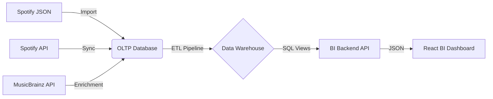
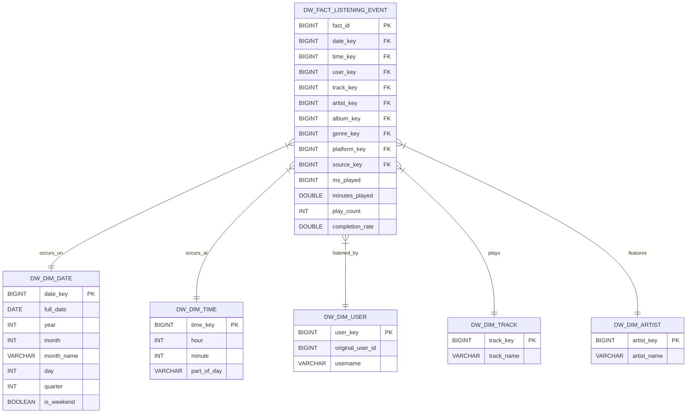
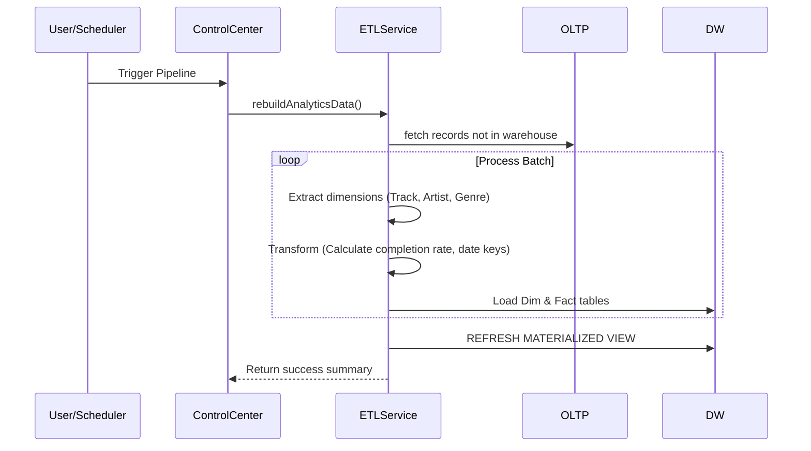

# Architecture Diagrams

## 1. High-Level Architecture Flow

```mermaid
graph LR
    A[Spotify JSON] -->|Import| B(OLTP Database)
    C[Spotify API] -->|Sync| B
    B -->|ETL Pipeline| D{Data Warehouse}
    E[MusicBrainz API] -->|Enrichment| B
    D -->|SQL Views| F[BI Backend API]
    F -->|JSON| G[React BI Dashboard]
```

## 2. Data Warehouse Star Schema

```mermaid
erDiagram
    DW_FACT_LISTENING_EVENT {
        BIGINT fact_id PK
        BIGINT date_key FK
        BIGINT time_key FK
        BIGINT user_key FK
        BIGINT track_key FK
        BIGINT artist_key FK
        BIGINT album_key FK
        BIGINT genre_key FK
        BIGINT platform_key FK
        BIGINT source_key FK
        BIGINT ms_played
        DOUBLE minutes_played
        INT play_count
        DOUBLE completion_rate
    }
    
    DW_DIM_DATE {
        BIGINT date_key PK
        DATE full_date
        INT year
        INT month
        VARCHAR month_name
        INT day
        INT quarter
        BOOLEAN is_weekend
    }
    
    DW_DIM_TIME {
        BIGINT time_key PK
        INT hour
        INT minute
        VARCHAR part_of_day
    }
    
    DW_DIM_USER {
        BIGINT user_key PK
        BIGINT original_user_id
        VARCHAR username
    }
    
    DW_DIM_TRACK {
        BIGINT track_key PK
        VARCHAR track_name
    }
    
    DW_DIM_ARTIST {
        BIGINT artist_key PK
        VARCHAR artist_name
    }
    
    DW_FACT_LISTENING_EVENT }|--|| DW_DIM_DATE : occurs_on
    DW_FACT_LISTENING_EVENT }|--|| DW_DIM_TIME : occurs_at
    DW_FACT_LISTENING_EVENT }|--|| DW_DIM_USER : listened_by
    DW_FACT_LISTENING_EVENT }|--|| DW_DIM_TRACK : plays
    DW_FACT_LISTENING_EVENT }|--|| DW_DIM_ARTIST : features
```

## 3. ETL Pipeline Process

```mermaid
sequenceDiagram
    participant User/Scheduler
    participant ControlCenter
    participant ETLService
    participant OLTP
    participant DW
    
    User/Scheduler->>ControlCenter: Trigger Pipeline
    ControlCenter->>ETLService: rebuildAnalyticsData()
    ETLService->>OLTP: fetch records not in warehouse
    loop Process Batch
        ETLService->>ETLService: Extract dimensions (Track, Artist, Genre)
        ETLService->>ETLService: Transform (Calculate completion rate, date keys)
        ETLService->>DW: Load Dim & Fact tables
    end
    ETLService->>DW: REFRESH MATERIALIZED VIEW
    ETLService-->>ControlCenter: Return success summary
```
